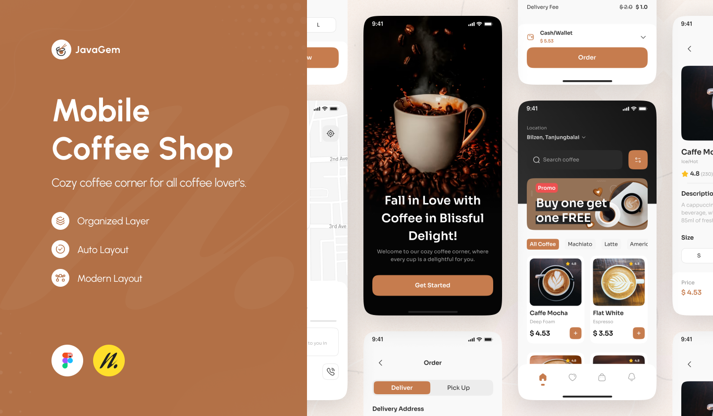

# Coffee Shop Customer Service Chatbot 🚀☕️

Welcome to the Coffee Shop Customer Service Chatbot project! This repository contains the code, resources, and instructions to build an AI-powered chatbot designed to enhance customer experiences in a coffee shop app. Leveraging the power of LLMs (Large Language models), Natural Language Processing (NLP), and RunPod's infrastructure, this chatbot can assist with taking orders, answering detailed menu queries, and providing personalized product recommendations—all within a React Native mobile app.

# 🎯 Project Overview
The goal of this project is to create a smart, **agent-based chatbot** that can:
* Handle real-time customer interactions with the chatbot including orders.
* Answer questions about menu items, including ingredients and allergens through a **Retreival augmented Generation (RAG) system**.
* Provide personalized product recommendations through a **market basket analysis recommendation engine**.
* Guide customers through a seamless order process, ensuring accurate and structured order details.
* Block irrelevant or harmful queries using a Guard Agent for safe and relevant interactions.
  
## 🧠 Chatbot Agent Architecture

The chatbot in this project is designed using a modular agent-based architecture, where each agent is responsible for a specific task, ensuring a seamless and efficient interaction between the user and the coffee shop’s services. This architecture enables the chatbot to perform complex actions by delegating tasks to specialized agents, making the system highly flexible, scalable, and easy to extend.

### 🤖 Key Agents in the System:
1. **Guard Agent:**
This agent acts as the first line of defense. It monitors all incoming user queries and ensures that only relevant and safe messages are processed by the other agents. It blocks inappropriate, harmful, or irrelevant queries, protecting the system and ensuring smooth conversations with users.
2. **Order Taking Agent:**
This agent is responsible for guiding customers through the order placement process. It uses chain-of-thought prompt engineering to simulate human-like reasoning, ensuring the order is accurately structured and all customer preferences are captured. It ensures that the chatbot gathers all necessary order details in a logical, step-by-step process, enhancing the reliability of the final order.
3. **Details Agent (RAG System):**
Powered by a Retrieval-Augmented Generation (RAG) system, the Details Agent answers specific customer questions about the coffee shop, including menu details, ingredients, allergens, and other frequently asked questions. It retrieves relevant data stored in the vector database and combines it with language generation capabilities to provide clear and precise responses.
4. **Recommendation Agent:**
This agent handles personalized product recommendations by working with the market basket recommendation engine. Triggered by the Order Taking Agent, it analyzes the user's current order or preferences and suggests complementary items. This agent aims to boost upselling opportunities or help users discover new products they might like.
5. **Classification Agent:**
This is the decision-making agent. It classifies incoming user queries and determines which agent is best suited to handle the task. By categorizing user intents, it ensures that queries are routed efficiently, whether the user is asking for recommendations, placing an order, or inquiring about specific menu details.

### ⚙️ How the Agents Work Together
The agents work collaboratively in a pipeline architecture to process user inputs:

1. A customer query is received and first assessed by the Guard Agent.
2. If valid, the Classification Agent determines the intent behind the user query (e.g., placing an order, asking about a product, or requesting a recommendation).
3. The query is then forwarded to the appropriate agent:
    * The Order Taking Agent handles order-related queries.
        * Order Agent can forward the order to the recommendation agent to try and upsell the user near the end of their order.
    * The Details Agent fetches specific menu information.
    * The Recommendation Agent suggests complementary products.

## 📱 React Native Coffee Shop App

The React Native Coffee Shop App serves as the front-end interface for customers to interact with the AI-powered chatbot and explore the menu. Designed with a clean, intuitive user experience in mind, the app seamlessly integrates the chatbot for real-time customer service, enabling users to place orders, receive personalized product recommendations, and get detailed information about menu items.

### Key Features:
* **Landing Page:** A welcoming entry point to the coffee shop experience.
* **Home Page:** Displays featured menu items and product categories.
* **Item Details Page:** Provides detailed descriptions, including ingredients and allergens for each item.
* **Cart Page:** Allows users to review and modify their order before checkout.
* **Chatbot Interface:** Enables customers to interact directly with the AI chatbot for order assistance, recommendations, and queries.
